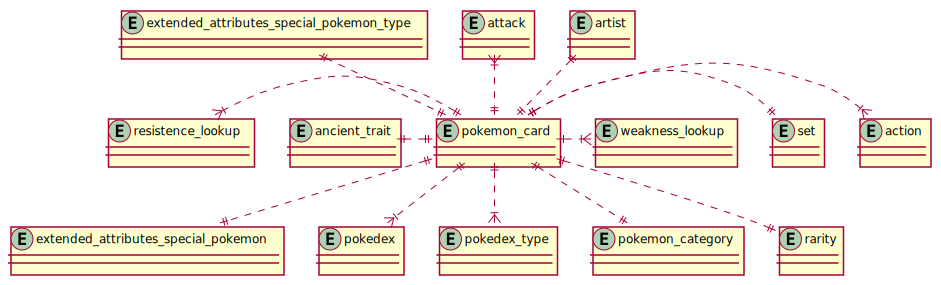

# pokemon-tcg-data

A collection of files containing data for the Pokémon trading card game

## Description

This is a repository that contains the raw data for a Pokémon TCG database. Within the 'data' directory is a collection of tab seperated files.  
The purpose of this data is to make freely available any information that would enable someone to manage their own collection, as this dataset provides additional information that other datasets do not include (hidden attributes for each card etc.).

## Contents

- [pokemon-tcg-data](#pokemon-tcg-data)
  - [Description](#description)
  - [Contents](#contents)
  - [Structure](#structure)
  - [Schema](#schema)
    - [entity_relationship_digrams](#entity_relationship_digrams)
    - [exported_images](#exported_images)
    - [Schemas](#schemas)
  - [Contributing](#contributing)
  - [Maintenance](#maintenance)
  - [Data](#data)
  - [License](#license)

## Structure

The table below describes the structure of this repository.

| Directory | Purpose |
| --- | --- |
| data | This contains the raw tab files. Some files use column from other files (see schema for further information) |
| database | This is an empty copy of the database with all data imported from the text files in the data directory |
| scripts | This is a directory for useful scripts |
| schema | The schema for the files and how they related to each other |

## Schema

The schema directory makes use of a program called [Plantuml](https://plantuml.com/). This has a dependency upon [Graphviz](https://www.graphviz.org/download/).
The schema directory contains two sub-directories:

- entity_relationship_diagrams
- exported_images

### entity_relationship_digrams

This is the raw plantuml code files that are used to produce the exported images.

### exported_images

This directory contains the exported files that are used to display within other files.

### Schemas

The files provided as part of this repository are able to be directly imported into a database.

This is the main relationship between each of the files (tables) and the data schemas for each table.

This is the relationship between the energy cards and other tables

This is the relationship between the pokémon cards and other tables

This is the relationship between the trainers cards and other tables

This is the relationship between all tables for reference

## Contributing

Feel free to make a branch and contribute to this repository where you see missing or incorrect data using the instructions below. I use a single master branch with feature branches from it (GitHub Flow).

1. Clone the repository
2. Create your feature branch (git checkout -b feature/my-new-feature)
3. Commit your changes (git commit -am 'Add some feature')
4. Push to the branch (git push origin feature/my-new-feature)
5. Create a new Pull Request

## Maintenance

I will try to maintain the data held in this repository but would like others to contribute if they find it useful. If you would like to make a user interface or extend this please feel free to do so, just let me know.

## Data

This section will describe each of the text files found within the data directory.

| File | Purpose |
| --- | --- |
| action_type.txt | This is a list of the types of actions found in any card |
| action.txt | This is a unique list of all the actions found across all cards, as several are re-used |
| ancient_trait.txt | This is a list of ancient traits given to Pokémon |
| artist.txt | This is a list of the artists who have designed the cards |
| attack.txt | This is a list of the attacks found across all cards |
| card_rule.txt | Several cards have a rule text assigned to them and this is the uniquq list |
| diamon_and_pearl_pokedex.txt | This is the alternative pokédex found in some sets use to number cards |
| energy_basic.txt | This is the basic types of energy found in the game and assigned to different elements on each card |
| energy_card.txt | This is a list of all the energy cards in the game that are not pokemon or trainer cards |
| energy_special.txt | This is a list of of all the extended types found under the umbrella of "Special" |
| extended_attributes_collection_specific.txt | This is a collection of attributes used to define extra details about a specific card in your collection |
| extended_attributes_core.txt | Several cards have core attributes which are detailed in this file |
| extended_attributes_special_pokemon_type.txt | This is a list of the attribute types found on a card that extend above the generic card details |
| extended_attributes_special_pokemon.txt | This is a set of data that can be found on certain sets and denotes a special type of card |
| generation.txt | This is a list of the generations of Pokemon |
| geographic_region.txt | This is the list of physical world release locations |
| pokedex_type.txt | This is a list of the types found within the pokedex which are different to the energy types |
| pokedex.txt | This is the national pokedex to classify all pokemon |
| pokemon_card.txt | This is a list of all the cards classified under the term 'Pokemon' and not trainer or energy |
| pokemon_category.txt | This is the category of the pokemon such as Stage 1 etc. |
| pokemon_region.txt | This is the in-game region of the pokemon |
| rarity.txt | This is the rarity level used on each of the cards |
| resistance_lookup.txt | This is lookup table file for use with other card files/tables that lists all the resistance variations |
| series.txt | This is a list of all the series of cards found within the TCG |
| set_data.txt | This is a list of all the sets of cards found within the TCG |
| trainer_card_type.txt | This is a unique list of the trainer card types as several are re-used across the game |
| trainer_card.txt | This is the list of all the Trainer cards which do not include the energy or pokemon cards |
| trainer_category.txt | This is the type of trainer card found within the game |
| weakness_lookup.txt | This is lookup table file for use with other card files/tables that lists all the weakness variations |

## License

This project is licensed under the Apache License 2.0 scheme, see license file within repository for further details. Feel free to copy and make use of.
